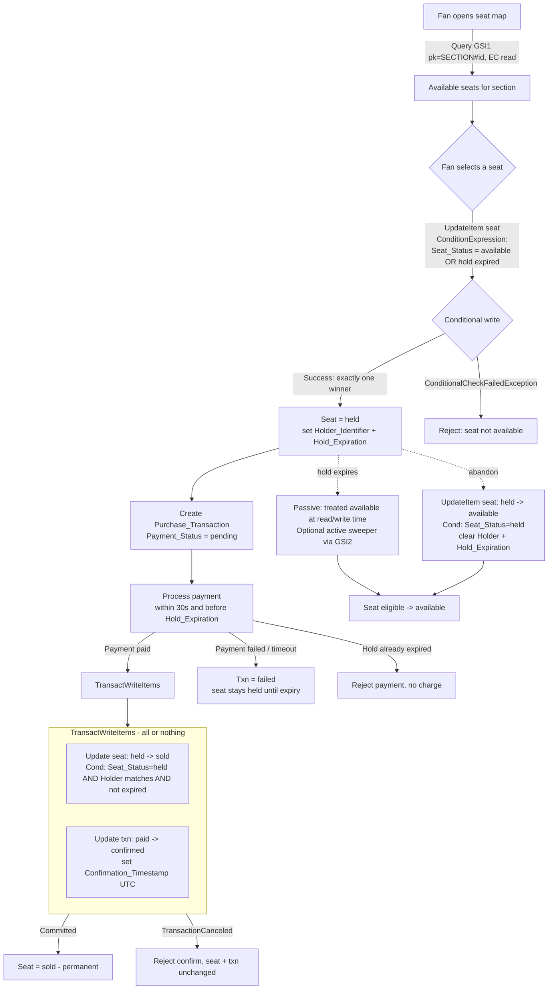
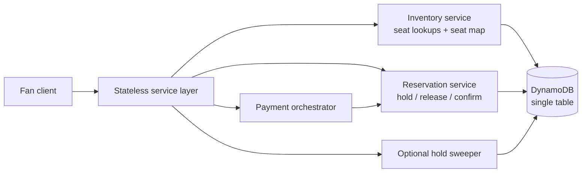

# Design Document — Fair Seat Purchase

## Overview

This design defines a DynamoDB data model and reservation protocol for a single 100,000-seat
venue where hundreds to thousands of fans purchase concurrently and inventory drains within
minutes. The system's central promise is **fairness and correctness**: every seat is sold
exactly once, no seat is ever oversold, and every state transition is atomic and
race-condition-free under contention on the same seat.

The design is organized around three pillars that map directly to the challenge's graded
categories:

1. **Correctness under contention.** Every seat lifecycle transition (`available → held`,
   `held → sold`, `held → available`) is a single DynamoDB conditional operation. Concurrent
   attempts resolve to exactly one winner via `ConditionalCheckFailedException`; there is no
   application-level lock, no read-then-write window, and therefore no race.

2. **Scale within service limits.** With 100,000 seats spread across the seat partition key
   space and up to 10,000 concurrent operations, no single partition is required to exceed
   1000 WCU / 3000 RCU. The one structural hot-spot risk — a popular section and its
   availability counter — is addressed with a documented write-sharding scheme and a
   scatter-gather read trade-off that is called out explicitly.

3. **Cost-aware access.** Every access pattern is a `GetItem` or `Query`, never a `Scan`.
   GSIs use intentionally scoped `KEYS_ONLY` or narrow `INCLUDE` projections. Reads that do
   not need strong consistency (the seat map, availability counts, expired-hold sweeps) use
   eventually-consistent reads; strong consistency is reserved for the read-back paths that
   must observe a just-committed transition.

### Design philosophy and why these decisions

DynamoDB gives us exactly one primitive that solves the oversell problem for free: the
**conditional write**. The entire design leans on this. Rather than coordinate fans with a
lock service, a queue, or optimistic version numbers checked in application code, we make the
seat item itself the single point of truth and let DynamoDB's per-item conditional evaluation
serialize contenders. This is the cheapest, simplest, and most correct option available, and
it is why the seat item's `Seat_Status` attribute — not a separate lock table — is the
arbiter of who wins a seat.

The main trade-offs we accept and justify in this document:

- **Single-table design** for operational simplicity and transactional coupling, at the cost
  of a slightly less obvious schema (Section: Data Models).
- **Passive (TTL-based) release with condition-at-read-time**, backed by an *optional* active
  sweeper, rather than relying on TTL alone. TTL deletion can lag up to ~48h, so correctness
  must never depend on it (Section: Temporary Hold and Expiration).
- **Sharded per-section availability counters** are offered as an option but are *not* on the
  critical correctness path; the authoritative availability answer is always derivable from
  the seat items themselves (Section: Scale and Cost).
- **On-demand capacity** as the default billing mode for a bursty, minutes-long sales event,
  with a provisioned-capacity discussion for predictable repeat events.

### Requirements coverage map

| Requirement | Where addressed in this design |
|---|---|
| R1 Seat inventory modeling | Data Models → Seat item; Key schema rationale |
| R2 Purchase transaction modeling | Data Models → Purchase transaction item |
| R3 Real-time availability display | Data Models → GSI1 seat map; Scale → consistency & counters |
| R4 Seat selection & temporary hold | Reservation Strategy → `available → held` |
| R5 Payment during active hold | Components → Payment flow; Reservation Strategy |
| R6 Confirmation and release | Reservation Strategy → `held → sold`, `held → available`, TransactWriteItems |
| R7 Sold-exactly-once guarantee | Reservation Strategy → contention resolution; Correctness Properties |
| R8 Atomic race-free transitions | Reservation Strategy → conditional writes & transactions |
| R9 Hold expiration mechanism | Temporary Hold and Expiration |
| R10 Scale & service-limit compliance | Scale and Cost |
| R11 Access pattern coverage | Data Models → Access Pattern Matrix |

## Architecture

The system is a set of stateless service operations in front of a single DynamoDB table.
All coordination happens inside DynamoDB via conditional writes and transactions; the service
layer holds no locks and no session-affinity state, so it scales horizontally and any request
can be served by any instance.

### Purchasing flow



Key points the diagram encodes:

- **The atomic hold** (`available → held`) is a single `UpdateItem` with a condition. This is
  the fairness-critical step where thousands of fans may contend for one seat (R4, R7.2).
- **Confirmation** (`held → sold`) is a `TransactWriteItems` because two items must change
  together — the seat and its purchase transaction (R6.3, R8.2).
- **Release** is either an explicit `held → available` conditional write (abandonment, R6.4)
  or passive expiration handled at read/write time plus an optional sweeper (R9).
- **Reads for browsing** hit GSI1 with eventually-consistent reads (R3.3, R10.7).

### Component responsibilities



## Components and Interfaces

The service layer is thin: it validates input, chooses the correct DynamoDB expression, and
translates DynamoDB outcomes into API responses. All the correctness logic lives in the
condition expressions, not in the application.

### Inventory service (R1, R3, R11)

- `getSeat(venue, section, row, seat)` → `GetItem` on the base table by primary key. Returns
  `Seat_Status`, `Holder_Identifier`, `Hold_Expiration`. Not-found → error (R11.1, R11.2).
- `getSeatMap(section)` → `Query` on GSI1 with `pk = SECTION#<venue>#<section>` and
  `sk begins_with STATUS#available`, eventually consistent (R3.1–R3.3, R11.3). Applies a
  read-time expiry filter so an expired-but-not-deleted held seat is not shown as unavailable
  (it appears via the sweep/status reconciliation; see Expiration).
- `getSectionAvailabilityCount(section)` → either read the sharded counter items (fast,
  approximate) or `Query`+count GSI1 (authoritative, more RCU). See Scale and Cost (R3.4,
  R11.4).

### Reservation service (R4, R6, R7, R8)

- `hold(seat, fanId, holdWindowSec=480)` → single conditional `UpdateItem` (R4).
- `release(seat, fanId)` → conditional `UpdateItem` `held → available` (R6.4, R6.6).
- `confirm(seat, fanId, txnId)` → `TransactWriteItems` coupling `held → sold` with
  `paid → confirmed` and confirmation timestamp (R6.1, R6.3, R8.2).

### Payment orchestrator (R2, R5)

- `initiatePayment(txnId, fanId, seat)` → verifies hold is active and holder matches before
  calling the external processor; on success invokes `confirm`; on failure/timeout sets
  `Payment_Status = failed` and leaves the seat held until expiry (R5.1–R5.7).
- Payment capture with the external processor is out of DynamoDB scope; the design only models
  the transaction record and its coupling to the seat transition.

### Optional hold sweeper (R9)

- Periodically `Query`s GSI2 (`pk = HOLDS`, `sk = Hold_Expiration`) for holds with
  `Hold_Expiration < now` and issues conditional `held → available` writes (R9.1, R9.2,
  R11.5). This is a latency optimization, not a correctness dependency.

## Data Models

### Single-table vs multi-table decision

**Decision: single-table design.** One table, `FairSeatPurchase`, holds both seat items and
purchase-transaction items, distinguished by key prefixes and an `Entity_Type` attribute.

Rationale and trade-offs:

- **Transactional coupling (decisive).** Confirmation must change a seat and its purchase
  transaction atomically (R6.3, R8.2). `TransactWriteItems` works across items in the same
  table (and can span tables), but keeping both entities in one table keeps the transaction,
  capacity accounting, and operational surface unified. This is the primary driver.
- **Operational simplicity.** One table means one billing mode, one set of alarms, one
  backup/restore unit. For a burst sales event this reduces the number of moving parts.
- **Trade-off — schema legibility.** Single-table designs are less self-documenting than a
  seats table + transactions table. We mitigate this with an explicit `Entity_Type` attribute
  and the access-pattern matrix below.
- **Trade-off — GSI blast radius.** All entities share the table's GSIs. We keep GSIs scoped
  so seat-only indexes are not polluted by transaction items (transaction items simply do not
  populate the GSI key attributes, so they are absent from those indexes).

If the transactional coupling requirement were removed, a multi-table design would be equally
valid and slightly more readable; the coupling is what tips the decision.

### Base table: `FairSeatPurchase`

| Element | Value |
|---|---|
| Partition key (PK) | `PK` (string) |
| Sort key (SK) | `SK` (string) |
| Billing mode | On-demand (default; see Scale and Cost) |
| TTL attribute | `Hold_Expiration` is a comparison timestamp used in condition expressions, **not** a TTL delete trigger — TTL is deliberately not the seat-release mechanism (see Temporary Hold and Expiration) |

#### Seat item

The seat is the unit of contention and the arbiter of correctness, so its key is chosen to
make **individual seat lookups a `GetItem`** (R1.9, R11.1) and to make **section-scoped
availability a single `Query`** via GSI1 (R3.1, R11.3).

- `PK = SEAT#<venue>#<section>` — groups a section's seats under one partition-key value for
  the base table, but note seats are still individually addressable by SK.
- `SK = ROW#<row>#SEAT#<seat>` — unique within the section, so `PK + SK` uniquely identifies a
  seat by venue/section/row/seat (R1.1). Creating a duplicate is rejected with a
  `attribute_not_exists(PK)` condition (R1.2).

> Key-schema rationale for concurrent lookups and atomic transitions: a seat's identity is a
> single (`PK`,`SK`) pair, so every hold/confirm/release targets one item by full primary key.
> DynamoDB evaluates conditional writes per item, so contention on one seat is serialized by
> the storage node holding that item — exactly the behavior we need for
> sold-exactly-once (R7, R8). Because seats are spread across 100,000 distinct SK values and
> many `SEAT#<venue>#<section>` PKs, write pressure is naturally distributed (see Scale).

Attributes:

| Attribute | Type | Notes |
|---|---|---|
| `PK` | S | `SEAT#<venue>#<section>` |
| `SK` | S | `ROW#<row>#SEAT#<seat>` |
| `Entity_Type` | S | `SEAT` |
| `Venue` | S | denormalized for projections |
| `Section` | S | denormalized |
| `Row` | S | denormalized |
| `Seat_Number` | S | denormalized |
| `Seat_Status` | S | `available` \| `held` \| `sold` (R1.3) |
| `Holder_Identifier` | S | present only when `held`/`sold` (R1.7); cleared on release (R6.6) |
| `Hold_Expiration` | N | epoch seconds; present only when `held` (R1.5); compared in condition expressions (not a TTL delete trigger — see Expiration) |
| `GSI1PK` | S | `SECTION#<venue>#<section>` — only set when available (see GSI1) |
| `GSI1SK` | S | `STATUS#available#ROW#<row>#SEAT#<seat>` |
| `GSI2PK` | S | `HOLDS` — only set when `held` (sharded; see GSI2) |
| `GSI2SK` | N | `Hold_Expiration` |
| `Version` | N | monotonic counter incremented on each transition (audit/debug) |

Item size: a seat item is a few hundred bytes, far under the 400 KB limit (R1.8, R10.4).

#### Purchase transaction item

- `PK = TXN#<fanId>` — a fan's transactions live under their own partition, so
  `getFanTransaction` is a `GetItem`/`Query` (R2.5, R11.6).
- `SK = TXN#<txnId>` — unique transaction id.

| Attribute | Type | Notes |
|---|---|---|
| `PK` | S | `TXN#<fanId>` |
| `SK` | S | `TXN#<txnId>` |
| `Entity_Type` | S | `TXN` |
| `Fan_Id` | S | references exactly one fan (R2.1) |
| `Seat_Ref` | S | `SEAT#<venue>#<section>|ROW#<row>#SEAT#<seat>` — references exactly one seat (R2.1) |
| `Payment_Status` | S | `pending` \| `paid` \| `failed` (R2.2) |
| `Txn_State` | S | `pending` \| `confirmed` \| `failed` |
| `Confirmation_Timestamp` | S | UTC ISO-8601, set only when confirmed (R2.3, R2.6) |
| `Created_At` | S | UTC ISO-8601 |

Item size is small and fixed, well under 400 KB (R10.4).

### Global Secondary Indexes

Each GSI is scoped intentionally to the attributes its access patterns read (R3.5, R10.8).

#### GSI1 — Seat map / available seats per section (R3, R11.3, R11.4)

- `GSI1PK = SECTION#<venue>#<section>`, `GSI1SK = STATUS#available#ROW#<row>#SEAT#<seat>`.
- **Sparse index by design:** `GSI1PK`/`GSI1SK` are written only while a seat is `available`.
  When a seat becomes `held` or `sold`, these attributes are removed, so the seat drops out of
  GSI1. This means a `Query` on GSI1 returns *only available seats* with no filter needed — the
  cheapest possible seat-map read, and the index shrinks as inventory sells (R3.2, R10.5).
- **Projection: `INCLUDE` {`Row`, `Seat_Number`, `Seat_Status`}** — only what the seat map
  renders. Not `ALL`, to minimize storage and read cost (R3.5, R10.8).
- Availability count = `Query` GSI1 with `Select=COUNT` (authoritative), or read sharded
  counters (approximate/fast) — see Scale and Cost.

#### GSI2 — Expired holds sweep (R9.2, R11.5)

- `GSI2PK = HOLDS#<shard>` (sharded 0..N-1), `GSI2SK = Hold_Expiration` (number).
- Sparse: set only while a seat is `held`; removed on transition to `sold`/`available`.
- **Projection: `KEYS_ONLY`** — the sweeper only needs to locate items, then it re-reads/writes
  the base item conditionally. Minimal cost (R10.8).
- Sweeper queries each shard for `GSI2SK < now` (R9.1, R9.2).

### Access Pattern Matrix (R11.10)

Every access pattern maps to a concrete table/index, key condition, and filter. No pattern
uses a `Scan`.

| # | Access pattern | Req | Table/Index | Operation | Key condition | Filter / projection | Consistency |
|---|---|---|---|---|---|---|---|
| AP1 | Look up one seat's status | R11.1, R1.9 | Base | GetItem | `PK=SEAT#v#s`, `SK=ROW#r#SEAT#n` | — | Strong (read-back) |
| AP2 | List available seats in a section (seat map) | R3.1, R11.3 | GSI1 | Query | `GSI1PK=SECTION#v#s AND begins_with(GSI1SK,"STATUS#available")` | projection INCLUDE {Row,Seat_Number,Seat_Status} | Eventual (R3.3) |
| AP3 | Section availability count | R3.4, R11.4 | GSI1 (or counter items) | Query `Select=COUNT` (or GetItem counters) | `GSI1PK=SECTION#v#s` | — | Eventual |
| AP4 | Find expired holds | R9.2, R11.5 | GSI2 | Query per shard | `GSI2PK=HOLDS#k AND GSI2SK < now` | KEYS_ONLY | Eventual |
| AP5 | Retrieve a fan's transaction | R2.5, R11.6 | Base | Query/GetItem | `PK=TXN#fan`, `SK=TXN#id` | — | Strong |
| AP6 | Hold a seat `available→held` | R4, R11.8 | Base | UpdateItem (conditional) | `PK,SK` of seat | Cond `Seat_Status=available` OR expired | Strong (conditional) |
| AP7 | Confirm `held→sold` + txn confirm | R6.1/6.3, R11.8 | Base | TransactWriteItems | seat `PK,SK` + txn `PK,SK` | Cond seat `held` & holder match & not expired; txn `paid` | Strong |
| AP8 | Release `held→available` (abandon) | R6.4, R11.8 | Base | UpdateItem (conditional) | seat `PK,SK` | Cond `Seat_Status=held` | Strong |
| AP9 | Create seat (seed inventory) | R1.1, R1.2 | Base | PutItem (conditional) | seat `PK,SK` | Cond `attribute_not_exists(PK)` | Strong |
| AP10 | Create purchase transaction | R2.1, R2.2 | Base | PutItem | txn `PK,SK` | Cond `attribute_not_exists(PK)` | Strong |

### Representative sample items

At least five representative seat items across all states, plus transactions, are provided in
the accompanying NoSQL Workbench model (`fair-seat-purchase.json`). Illustrative shapes:

```json
[
  {
    "PK": "SEAT#VENUE1#A", "SK": "ROW#1#SEAT#1", "Entity_Type": "SEAT",
    "Venue": "VENUE1", "Section": "A", "Row": "1", "Seat_Number": "1",
    "Seat_Status": "available",
    "GSI1PK": "SECTION#VENUE1#A", "GSI1SK": "STATUS#available#ROW#1#SEAT#1",
    "Version": 0
  },
  {
    "PK": "SEAT#VENUE1#A", "SK": "ROW#1#SEAT#2", "Entity_Type": "SEAT",
    "Venue": "VENUE1", "Section": "A", "Row": "1", "Seat_Number": "2",
    "Seat_Status": "held", "Holder_Identifier": "FAN#alice",
    "Hold_Expiration": 1735689600,
    "GSI2PK": "HOLDS#3", "GSI2SK": 1735689600, "Version": 1
  },
  {
    "PK": "SEAT#VENUE1#A", "SK": "ROW#1#SEAT#3", "Entity_Type": "SEAT",
    "Venue": "VENUE1", "Section": "A", "Row": "1", "Seat_Number": "3",
    "Seat_Status": "sold", "Holder_Identifier": "FAN#bob", "Version": 2
  },
  {
    "PK": "SEAT#VENUE1#B", "SK": "ROW#5#SEAT#10", "Entity_Type": "SEAT",
    "Venue": "VENUE1", "Section": "B", "Row": "5", "Seat_Number": "10",
    "Seat_Status": "available",
    "GSI1PK": "SECTION#VENUE1#B", "GSI1SK": "STATUS#available#ROW#5#SEAT#10",
    "Version": 0
  },
  {
    "PK": "SEAT#VENUE1#B", "SK": "ROW#5#SEAT#11", "Entity_Type": "SEAT",
    "Venue": "VENUE1", "Section": "B", "Row": "5", "Seat_Number": "11",
    "Seat_Status": "held", "Holder_Identifier": "FAN#carol",
    "Hold_Expiration": 1735689900, "GSI2PK": "HOLDS#7", "GSI2SK": 1735689900,
    "Version": 1
  },
  {
    "PK": "TXN#alice", "SK": "TXN#t-1001", "Entity_Type": "TXN",
    "Fan_Id": "FAN#alice", "Seat_Ref": "SEAT#VENUE1#A|ROW#1#SEAT#2",
    "Payment_Status": "pending", "Txn_State": "pending",
    "Created_At": "2025-01-01T00:00:00Z"
  },
  {
    "PK": "TXN#bob", "SK": "TXN#t-1002", "Entity_Type": "TXN",
    "Fan_Id": "FAN#bob", "Seat_Ref": "SEAT#VENUE1#A|ROW#1#SEAT#3",
    "Payment_Status": "paid", "Txn_State": "confirmed",
    "Confirmation_Timestamp": "2025-01-01T00:03:12Z",
    "Created_At": "2025-01-01T00:00:05Z"
  }
]
```

## Reservation Strategy (core)

This is the heart of the design. Every seat lifecycle transition is a single DynamoDB
conditional operation whose condition asserts the expected source state. DynamoDB evaluates
the condition and applies the write atomically on the item's storage node, so concurrent
contenders are serialized and exactly one wins (R7, R8).

### `available → held` (hold a seat) — single conditional UpdateItem (R4)

A single `UpdateItem` is sufficient because only one item changes. The condition treats an
**expired hold as available** so a fan can grab a seat whose hold lapsed even before physical
cleanup (R9.6).

```
UpdateItem
  Key: { PK: "SEAT#VENUE1#A", SK: "ROW#1#SEAT#2" }
  UpdateExpression:
    SET Seat_Status = :held,
        Holder_Identifier = :fan,
        Hold_Expiration = :exp,
        GSI2PK = :holdsShard,
        GSI2SK = :exp,
        Version = Version + :one
    REMOVE GSI1PK, GSI1SK
  ConditionExpression:
    Seat_Status = :available
    OR (Seat_Status = :held AND Hold_Expiration <= :now)
  ExpressionAttributeValues:
    :available = "available", :held = "held",
    :fan = "FAN#alice", :exp = <now+480>, :now = <now>,
    :holdsShard = "HOLDS#3", :one = 1
```

- On success: seat is `held`, holder + expiration set, removed from GSI1 (no longer
  available), added to GSI2 (sweepable) (R4.2, R4.4, R4.5).
- On `ConditionalCheckFailedException`: seat was not available (or held-and-not-expired) →
  reject, nothing changed, "seat not available" (R4.6).
- **Concurrency:** N fans issue this write on the same seat. DynamoDB applies them one at a
  time against the current item; the first flips `available → held`, so every subsequent
  condition (`Seat_Status = available`) fails → exactly one winner, N-1
  `ConditionalCheckFailedException` losers (R4.7, R7.2, R7.3, R8.6). The defined failure for
  losers is `ConditionalCheckFailedException` surfaced as "seat no longer available".

### `held → sold` (confirm) — TransactWriteItems (R6.1, R6.3, R8.2)

Confirmation must change **two items together** — flip the seat to `sold` and stamp the
transaction confirmed — so a partial commit can never leave a sold seat without a confirmed
transaction or vice versa. That is precisely what `TransactWriteItems` guarantees
(all-or-nothing) (R6.3, R8.2). A single `UpdateItem` is insufficient here because it cannot
span two items.

```
TransactWriteItems:
  - Update:
      Key: { PK: "SEAT#VENUE1#A", SK: "ROW#1#SEAT#2" }
      UpdateExpression:
        SET Seat_Status = :sold, Version = Version + :one
        REMOVE Hold_Expiration, GSI2PK, GSI2SK
      ConditionExpression:
        Seat_Status = :held
        AND Holder_Identifier = :fan
        AND Hold_Expiration > :now
      ExpressionAttributeValues:
        :sold="sold", :held="held", :fan="FAN#alice", :now=<now>, :one=1
  - Update:
      Key: { PK: "TXN#alice", SK: "TXN#t-1001" }
      UpdateExpression:
        SET Payment_Status = :paid, Txn_State = :confirmed,
            Confirmation_Timestamp = :ts
      ConditionExpression: Payment_Status = :paid
      ExpressionAttributeValues:
        :paid="paid", :confirmed="confirmed", :ts="2025-01-01T00:03:12Z"
```

- The seat condition requires `held`, matching holder, and **not expired** — so a confirm on an
  expired hold is rejected without capturing the sale (R9.3, R6.2).
- On success: seat `sold`, txn confirmed with UTC timestamp; seat removed from GSI2 (R2.3, R6.3).
- On `TransactionCanceledException` (any condition fails): neither item changes; "seat cannot
  be confirmed" (R6.2). Under concurrent confirms, exactly one wins, others fail
  (R7.4, R7.5).
- `sold` has **no outbound transition** in any expression — no write ever moves a seat out of
  `sold`, guaranteeing permanence (R7.6, R8.4).

### `held → available` (release / abandon) — single conditional UpdateItem (R6.4)

```
UpdateItem
  Key: { PK: "SEAT#VENUE1#A", SK: "ROW#1#SEAT#2" }
  UpdateExpression:
    SET Seat_Status = :available,
        GSI1PK = :sectionPk, GSI1SK = :sectionSk,
        Version = Version + :one
    REMOVE Holder_Identifier, Hold_Expiration, GSI2PK, GSI2SK
  ConditionExpression: Seat_Status = :held
  ExpressionAttributeValues:
    :available="available", :held="held",
    :sectionPk="SECTION#VENUE1#A", :sectionSk="STATUS#available#ROW#1#SEAT#2", :one=1
```

- Clears holder and expiration, re-adds the seat to GSI1 (available again), removes it from
  GSI2 (R6.6).
- Condition `Seat_Status = held`: releasing an already-`sold` seat fails →
  "already sold" (R6.7); releasing an already-`available` seat also fails the condition and is
  reported as a no-op "no action required" (R6.8).

### Where TransactWriteItems is needed vs a single conditional UpdateItem

| Transition | Items changed | Mechanism | Why |
|---|---|---|---|
| `available → held` | seat only | `UpdateItem` + condition | one item; condition serializes contenders (R4, R8.1) |
| `held → available` | seat only | `UpdateItem` + condition | one item (R6.4) |
| `held → sold` | seat **and** transaction | `TransactWriteItems` | two items must commit together (R6.3, R8.2) |

The rule: use the cheaper single conditional `UpdateItem` whenever exactly one item changes;
escalate to `TransactWriteItems` only when correctness requires two items to move atomically.
`TransactWriteItems` costs 2x WCU and has stricter throttling behavior, so we do not use it
where a single conditional write suffices.

## Temporary Hold and Expiration (R9)

### Hold window

On `available → held`, `Hold_Expiration = now + Hold_Window`, where `Hold_Window` defaults to
**8 minutes (480 s)** and is configurable in [60, 1800] s (R4.2, R4.3, R9.7). The value is
stored on the seat item as epoch seconds so it is directly comparable in condition expressions
and usable as the TTL attribute.

### Release strategy: hybrid (passive condition-at-read-time + TTL + optional active sweeper)

**Decision: a hybrid strategy, with correctness resting entirely on condition-at-read-time.**
This is a graded decision, so the reasoning is spelled out:

1. **Condition-at-read-time is the source of truth (mandatory).** Every write that could be
   blocked by a stale hold treats an expired hold as available *in its condition expression*:
   the hold condition allows `Seat_Status = held AND Hold_Expiration <= now`, and the confirm
   condition requires `Hold_Expiration > now`. This means the *physical* state of the item is
   irrelevant to correctness — an expired-but-not-deleted held seat behaves exactly like an
   available seat at write time (R9.6). No fan can be blocked by, or confirm on, an expired
   hold regardless of any background process.

2. **TTL is deliberately NOT the seat-release mechanism.** It is tempting to register
   `Hold_Expiration` as the table's TTL attribute and let DynamoDB free expired holds
   automatically, but that is wrong for two reasons. First, **TTL deletes the entire item** —
   it cannot flip a status field back to `available`. A seat must survive hold expiration and
   return to inventory, not vanish, so TTL-deleting a held seat would lose a unit of inventory
   we are required to track (R1). Second, **TTL deletion is not prompt**: DynamoDB typically
   removes expired items within minutes but guarantees only that deletion happens *eventually*,
   with worst-case latency of up to ~48 hours. A fairness guarantee cannot depend on a
   best-effort background deletion with that latency. We therefore do **not** use TTL to
   release seats; `Hold_Expiration` is a comparison timestamp evaluated inside condition
   expressions, never a delete trigger. TTL would be appropriate only for genuinely disposable
   auxiliary records, of which the core model has none.

3. **Active sweeper (latency optimization, optional).** To make the *seat map* reflect freed
   seats promptly (within 60 s of expiry, R9.1) rather than only at the next contended write,
   an optional sweeper `Query`s GSI2 shards for `Hold_Expiration < now` and issues the
   `held → available` conditional write for each. This is what physically re-populates GSI1 so
   browsing fans see the seat again quickly. It is a performance/UX optimization; if it stops,
   the seat is still *logically* available and grabbable via condition-at-read-time.

**Why hybrid rather than pure-active or pure-passive:**

- *Pure passive (condition-only)* is perfectly correct but leaves expired-held seats missing
  from the seat map (GSI1) until someone tries to grab them, hurting availability display (R3).
- *Pure active (sweeper-only)* makes the map fresh but introduces a window where correctness
  would depend on the sweeper running — unacceptable for a fairness guarantee.
- *Hybrid* gets correctness from conditions (never depends on a background job) and freshness
  from the sweeper (best-effort UX). This is the strongest combination.

### Treating expired holds as available at read and write time (R9.6)

- **Write time:** enforced by the condition expressions above.
- **Read time (seat map):** the seat-map `Query` on GSI1 may include the read-time rule that a
  seat whose `Hold_Expiration <= now` is reported available. Because held seats are not in
  GSI1, the practical mechanism is the sweeper promptly moving them back; between expiry and
  sweep, a fan who *attempts* to hold still succeeds via the write-time condition. This keeps
  correctness and display consistent without a strong-consistency read on the hot path.

## Scale and Cost (R10)

### No partition exceeds 1000 WCU / 3000 RCU

- **Seat writes are naturally distributed.** With 100,000 seats and base-table partition key
  `SEAT#<venue>#<section>`, seats spread across many partition-key values, and DynamoDB further
  splits partitions by internal hashing. Up to 10,000 concurrent operations across 100,000
  seats averages well below any single item/partition's limit. A single *item* also has a
  per-item write ceiling; because contention on one seat resolves to one winner and losers fail
  fast on the condition, sustained successful WCU on any one seat is bounded by the number of
  legitimate transitions (at most 3 over its lifetime) (R10.1).
- **Item-collection and partition throughput** stay within 1000 WCU / 3000 RCU because no
  single `PK` concentrates all writes: even a fully sold-out section of, say, 5,000 seats sees
  its writes distributed across 5,000 distinct SKs and DynamoDB's adaptive capacity /
  auto-split. (R10.1)

### Hot-partition risk and write sharding (R10.2, R10.3)

The real hot-spot is not the seats themselves but **aggregate structures keyed by one value**:

1. **GSI2 expired-hold index** would be a single hot partition if keyed `GSI2PK = "HOLDS"`.
   **Write-sharding scheme:** `GSI2PK = "HOLDS#" + (hash(seatId) mod N)` with N (e.g., 10–50)
   shards. Holds distribute across N partitions; the sweeper scatter-gathers by querying all N
   shards. **Trade-off:** sweeping now costs N queries instead of 1 (scatter-gather read
   overhead) in exchange for removing the write hot spot. N is chosen so per-shard write rate
   stays under 1000 WCU at peak (R10.2, R10.3).

2. **Per-section availability counter** (if used) is a single item per section and would be a
   write hot spot in a popular section where thousands of seats change state per second. See
   below.

### Per-section availability counters: aggregate item vs computed count

Two options, with the trade-off stated explicitly (R3.4, R11.4):

- **Option A — compute on read (authoritative, default).** `Query` GSI1 with `Select=COUNT`.
  No counter item, so no write hot spot and the count is always exactly correct. **Trade-off:**
  each count read consumes RCU proportional to the number of available seats in the section
  (though COUNT projects nothing, it still reads index entries). For a 5,000-seat section this
  is modest and eventually-consistent reads halve the cost. This is the default because it
  carries **zero correctness risk** and no extra write load on the hot sell path.

- **Option B — aggregate counter item (fast, approximate).** One item per section holding
  `Available_Count`, atomically decremented/incremented (`ADD Available_Count :delta`) on each
  transition. **Trade-off:** O(1) read, but every seat transition now also writes the counter,
  concentrating writes on one item → a **write hot spot** in popular sections. Mitigation:
  **shard the counter** into M sub-counters (`SECTION#s#COUNTER#<0..M-1>`), write to a random
  shard, and sum M items on read (scatter-gather). Counters can also drift under failures, so
  they are treated as a display hint, never as the oversell guard.

**Recommendation:** default to Option A (computed) for correctness and simplicity; adopt
sharded Option B only if profiling shows count reads dominate cost. The oversell guarantee
never depends on counters either way.

### Consistency choices (R10.7)

- **Eventually consistent:** seat map (AP2), availability count (AP3), expired-hold sweep
  (AP4). These tolerate ~seconds of staleness and halve RCU cost (R3.3, R10.7).
- **Strongly consistent / conditional:** the hold, confirm, and release writes are conditional
  (which are always evaluated against current item state), and read-backs that must observe a
  just-committed transition (e.g., confirming the fan's own seat via AP1/AP5). Conditional
  writes inherently see the latest committed value, so oversell is impossible even though reads
  elsewhere are eventual.

### Item size (R10.4)

Seat and transaction items are a few hundred bytes each — three orders of magnitude under the
400 KB limit. No large blobs are stored on items.

### On-demand vs provisioned capacity

- **On-demand (default).** A sales event is bursty and short: traffic goes from near-zero to
  10,000 concurrent ops within seconds and drains in minutes. On-demand absorbs spikes with no
  capacity planning and no throttling from under-provisioning, at a higher per-request price.
  For an unpredictable, minutes-long burst, paying per request beats over-provisioning idle
  capacity. **Cost trade-off:** on-demand's per-request rate is higher than well-utilized
  provisioned capacity, so for *repeat, predictable* on-sales, provisioned capacity with
  auto-scaling (and optionally reserved capacity) is cheaper.
- **Provisioned (alternative).** If the on-sale time and volume are known and recurring,
  provisioned mode with a pre-warmed scaling schedule can cut cost substantially, at the risk
  of throttling if the forecast is wrong. Given the challenge emphasizes bursty fairness over
  cost predictability, on-demand is the safer default.
- **Throttling handling:** regardless of mode, throttled operations retry with exponential
  backoff up to 5 attempts; exhausting retries returns an error while preserving state (R10.9).

### Scan avoidance (R10.5, R10.6)

Every access pattern (AP1–AP10) is a `GetItem`, `Query`, `UpdateItem`, `PutItem`, or
`TransactWriteItems`. No pattern uses a `Scan`, so R10.6's documentation clause is vacuously
satisfied (there is no Scan to justify).

### Limitations and what changes at larger scale

This design is tuned for a single 100,000-seat venue with a minutes-long burst. The honest
limitations, and the changes we would make if the scale assumptions changed:

- **A single hot section.** If one section (for example a general-admission floor block)
  concentrated a large share of demand, its base-table `PK` (`SEAT#<venue>#<section>`) could
  approach partition throughput limits even with DynamoDB adaptive capacity. At that scale we
  would shard the seat partition key itself (`SEAT#<venue>#<section>#<shard>`) and
  scatter-gather the seat map — the same read-fan-out trade-off we already accept for the
  expired-hold index.
- **Availability-count cost.** The default computed count (Option A) consumes RCU proportional
  to section size. If count reads dominated cost at much larger venues or across many
  simultaneous events, we would adopt the sharded counter (Option B) and treat it strictly as a
  display hint, never as the oversell guard.
- **Sweeper fan-out.** The optional sweeper's scatter-gather cost grows linearly with the shard
  count N. For a much higher hold-churn rate we would either raise N (more parallelism, more
  queries per sweep) or replace polling with a DynamoDB Streams consumer that reacts to hold
  writes instead of scanning shards on a timer.
- **Multi-venue / multi-event.** For many concurrent events we would extend the partition key
  space (already prefixed by venue) and likely isolate each event into its own table to bound
  blast radius and capacity, accepting added cross-event operational overhead.
- **Capacity mode.** On-demand is the safe default for an unpredictable burst; for a recurring,
  well-forecast on-sale we would move to provisioned capacity with a pre-warmed scaling
  schedule to cut cost, accepting throttling risk if the forecast is wrong.

None of these changes touches the correctness core: the conditional-write oversell guard and
the condition-at-read-time expiration rule remain the source of truth at any scale.

## Correctness Properties

*A property is a characteristic or behavior that should hold true across all valid executions
of a system — essentially, a formal statement about what the system should do. Properties
serve as the bridge between human-readable specifications and machine-verifiable correctness
guarantees.*

These properties are the fairness and correctness invariants of the ticketing system. They are
derived from the prework analysis and consolidated to remove redundancy: the many
per-transition acceptance criteria (R4.1/4.6, R6.1/6.2/6.4/6.7/6.8, R8.1/8.3/8.4/8.5, R11.9)
collapse into a single guarded-transition-legality property; the concurrency criteria
(R4.7/7.2/7.3 and R7.4/7.5 and R8.6/11.8) collapse into the concurrency properties; and the
expiration criteria (R1.5/1.6/4.2/4.3/6.5/9.6/9.7) collapse into the hold-expiration
properties. Each property is implemented by exactly one property-based test.

### Property 1: Sold-exactly-once

*For any* seat and *any* sequence of operations (holds, releases, payments, confirmations,
including interleaved/concurrent attempts and retries), the cumulative number of successful
transitions of that seat into the `sold` state is at most 1.

**Validates: Requirements 7.1, 7.4, 7.5**

### Property 2: Sold is permanent (monotonicity)

*For any* seat and *any* subsequent sequence of operations after it has become `sold`
(including concurrent access, retries, and simulated restart), the seat's status remains
`sold` and never returns to `available` or `held`.

**Validates: Requirements 7.6**

### Property 3: Guarded transition legality

*For any* seat in *any* status and *any* requested transition, the transition is applied if and
only if (a) it is one of the three permitted transitions (`available → held`, `held → sold`,
`held → available`) and (b) the seat's current status equals the transition's required source
status; otherwise the request is rejected and the seat's status, holder, and expiration are
left unchanged.

**Validates: Requirements 4.1, 4.6, 6.1, 6.2, 6.4, 6.7, 6.8, 8.1, 8.3, 8.4, 8.5, 11.9**

### Property 4: At most one concurrent transition commits

*For any* single seat targeted by N ≥ 2 concurrent transition attempts, at most one attempt
commits successfully and every other attempt fails (with a conflict/condition failure) leaving
the seat state as produced by the single winner.

**Validates: Requirements 8.6, 11.8**

### Property 5: Concurrent holds resolve to exactly one winner

*For any* `available` seat targeted by N ≥ 2 concurrent hold attempts (N from 2 up to at least
10,000), exactly one attempt transitions the seat to `held` and every other attempt is
rejected with a "seat not available" failure and makes no change to the seat.

**Validates: Requirements 4.7, 7.2, 7.3**

### Property 6: Concurrent confirmations resolve to exactly one winner

*For any* `held` seat targeted by N ≥ 2 concurrent confirmation attempts (N from 2 up to at
least 10,000), exactly one attempt transitions the seat to `sold` and every other attempt is
rejected while the winner's `sold` transition is not rolled back.

**Validates: Requirements 7.4, 7.5**

### Property 7: Confirmation requires matching holder and an unexpired hold

*For any* seat and confirming fan, the confirmation succeeds only if the seat is `held`, its
`Holder_Identifier` equals the confirming fan, and the current time is before `Hold_Expiration`;
otherwise the confirmation is rejected and both the seat and its purchase transaction are left
unchanged.

**Validates: Requirements 6.1, 6.2, 9.3**

### Property 8: Confirmation atomicity (seat + transaction all-or-nothing)

*For any* confirmation, either both the seat transitions to `sold` and its purchase transaction
becomes `confirmed` with a UTC confirmation timestamp, or neither change is applied; no partial
outcome is ever observable.

**Validates: Requirements 6.3, 8.2**

### Property 9: Hold expiration is set within bounds

*For any* successful `available → held` transition with a configured hold window W, the seat's
`Hold_Expiration` equals the transition time plus W, W lies within [60, 1800] seconds
(default 480), and the expiration exceeds the creation time by no more than 600 seconds.

**Validates: Requirements 1.5, 4.2, 4.3, 9.7**

### Property 10: Expired holds are treated as available at read and write time

*For any* seat that is physically `held` but whose `Hold_Expiration` is at or before the
current time, a subsequent hold attempt succeeds (the seat is grabbable) and availability views
treat the seat as available, regardless of whether background cleanup has run; upon release the
`Holder_Identifier` and `Hold_Expiration` are cleared.

**Validates: Requirements 1.6, 6.5, 6.6, 9.6**

### Property 11: Holder presence invariant

*For any* seat reachable through any sequence of operations, whenever its status is `held` or
`sold` it has a non-empty `Holder_Identifier`, and whenever its status is `available` it has no
holder and no hold expiration.

**Validates: Requirements 1.7, 6.6**

### Property 12: Payment precondition and outcome

*For any* payment attempt, the payment is accepted only while the seat is `held`, the current
time is before `Hold_Expiration`, and the paying fan matches `Holder_Identifier`; a rejected
payment (not held, expired, or holder mismatch) captures no funds and leaves `Payment_Status`
unchanged. On acceptance, success sets `Payment_Status = paid` and failure or timeout sets
`Payment_Status = failed` while the seat remains `held` until expiration.

**Validates: Requirements 5.1, 5.2, 5.4, 5.5, 5.6, 5.7, 9.4**

### Property 13: Transaction lifecycle legality and outcome

*For any* purchase transaction and requested lifecycle transition, the transition is applied if
and only if it is one of `pending → paid`, `pending → failed`, or `paid → confirmed`; a `paid`
transition to `confirmed` records a UTC confirmation timestamp, a `failed` transaction is
retained with no confirmation timestamp, and every transaction is created with
`Payment_Status = pending`.

**Validates: Requirements 2.2, 2.3, 2.4, 2.6**

### Property 14: Seat identity uniqueness

*For any* set of seats, the mapping from (venue, section, row, seat number) to the storage key
(`PK`, `SK`) is injective, and an attempt to create a seat whose coordinates already exist is
rejected while leaving the existing seat unchanged.

**Validates: Requirements 1.1, 1.2**

### Property 15: Availability view correctness

*For any* section in *any* mixture of seat states, a seat-map query returns exactly the seats
whose effective status is `available` (physical `available`, plus `held` seats whose hold has
expired), and the section availability count equals the number of such seats, bounded within
[0, section capacity].

**Validates: Requirements 3.1, 3.4, 11.3, 11.4**

### Property 16: Status value validity

*For any* value, setting a seat's `Seat_Status` succeeds only if the value is exactly one of
`available`, `held`, or `sold`, and a newly created seat has status `available`.

**Validates: Requirements 1.3, 1.4**

### Property 17: Shard key distribution

*For any* seat identifier, its expired-hold shard key is `hash(seatId) mod N` and lies in
`[0, N)`, and over a large set of seat identifiers the assignment is approximately uniform
across the N shards.

**Validates: Requirements 10.2, 10.3**

## Error Handling

Error handling is expressed almost entirely through DynamoDB condition semantics, so most
"errors" are expected, well-defined outcomes rather than exceptional failures.

### Conditional write failures (the normal path for contention)

- `ConditionalCheckFailedException` on a hold/release `UpdateItem` → the guard did not match
  (seat not in the required source state). Surfaced as a domain failure: "seat not available"
  (hold, R4.6), "already sold" or "no action required" (release, R6.7/R6.8). The seat is
  unchanged (R8.3).
- `TransactionCanceledException` on a confirm `TransactWriteItems` → at least one condition
  failed (seat not `held`, holder mismatch, hold expired, or txn not `paid`). Surfaced as
  "seat cannot be confirmed"; neither item changes (R6.2, R7.5, R9.3).
- These are **not retried blindly**: a failed condition means someone else won or state
  changed, so the correct response is to re-read and inform the fan, not to retry the same
  write.

### Not-found and validation errors

- `GetItem` returning no item for a seat/transaction lookup → "not found" error, no data
  modified (R11.2, R11.7).
- Invalid `Seat_Status` value, invalid transition request, invalid hold window, or unknown
  section → validation error returned before any write; no state change (R1.3, R3.6, R8.5).

### Throttling and transient failures

- On `ProvisionedThroughputExceededException` / `ThrottlingException` / `RequestLimitExceeded`,
  retry with exponential backoff (jittered) up to 5 attempts. If all attempts fail, return an
  error to the caller while preserving current state; no partial writes occur because each
  attempt is itself atomic (R10.9).
- `TransactWriteItems` that fails for transient reasons (not condition failure) follows the
  same bounded-retry policy; condition-failure cancellations are surfaced immediately, not
  retried.

### Payment errors

- Payment processor failure or timeout → set `Payment_Status = failed`, leave the seat `held`
  until its natural expiration, return a payment-failure/timeout response (R5.4, R5.5). The
  seat is not force-released, so the fan can retry payment while the hold is still active.
- Payment attempted after expiration or by a non-holder → rejected before contacting the
  processor; no funds captured (R5.6, R5.7, R9.4).

## Testing Strategy

### Dual approach

- **Property-based tests** verify the 17 universal invariants above across randomized inputs
  and randomized operation sequences (including concurrency simulations). These are the primary
  correctness evidence for this fairness-critical system.
- **Example-based unit tests** cover specific scenarios and error cases that are not universal:
  invalid-section error (R3.6), timeout-availability error (R3.7), not-found lookups
  (R11.2, R11.7), and the throttling retry-then-error behavior (R10.9).
- **Integration / smoke tests** cover behavior that is DynamoDB's or infrastructure's rather
  than our logic: eventual-consistency propagation timing (R3.3), sweeper release-within-60s
  timing (R9.1), no-partition-exceeds-limits under load (R10.1), GSI projection scoping
  (R3.5, R10.8), and Query/GetItem-not-Scan access-layer audits (R1.9, R2.5, R3.2, R9.2,
  R10.5, R11.x).

### Property-based testing configuration

The core seat state machine is pure input/output logic (guarded transitions over a modeled
seat/transaction state) and therefore an excellent fit for property-based testing. Tests run
against an in-memory model of the conditional-write semantics (and, for concurrency properties,
a serializing model of contended writes), with DynamoDB itself exercised in a small number of
integration tests.

- Use an established property-based testing library for the implementation language (for
  example, fast-check for TypeScript/JavaScript, Hypothesis for Python, jqwik/QuickTheories
  for Java). Do **not** hand-roll a property framework.
- Run a **minimum of 100 iterations** per property test.
- Concurrency properties (5, 6) generate N contenders (N from 2 up to at least 10,000) and
  assert exactly-one-winner against the serialized-conditional-write model.
- Tag each property test with a comment referencing its design property, in the format:
  **Feature: fair-seat-purchase, Property {number}: {property_text}**

Example tag:

```
// Feature: fair-seat-purchase, Property 1: Sold-exactly-once
// For any seat and any sequence of operations, successful sold transitions <= 1.
```

### What is intentionally NOT property-tested

Per the prework classification, the following use unit, integration, or smoke tests rather than
PBT because behavior does not vary meaningfully with input or is external:
item-size-under-400KB (R1.8/R10.4, smoke), access-layer Scan-avoidance and GSI projection
scoping (structural/smoke), eventual-consistency and sweeper timing (integration), and
capacity-under-load (integration/load test). The write-sharding distribution (Property 17) is
included as a property because the hash-to-shard mapping is our logic and its uniformity is
input-varying.
