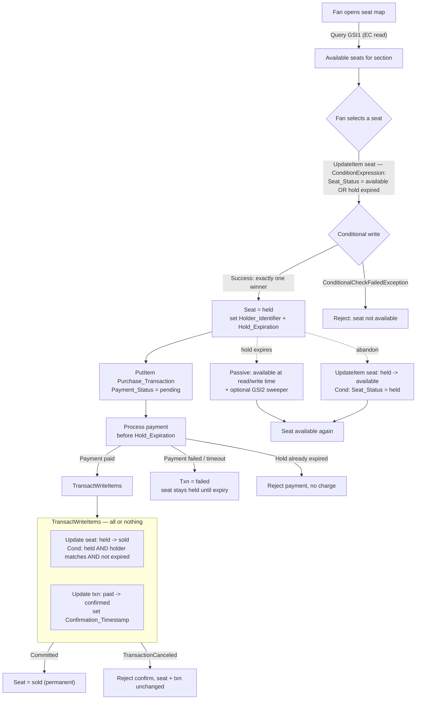

# The Fair Seat Purchase — DynamoDB Design Document

A single-table DynamoDB design for a 100,000-seat venue where thousands of fans purchase
concurrently and inventory drains in minutes. The central promise is **fairness and
correctness**: every seat is **sold exactly once** — never oversold, never lost — while the
experience stays fast under extreme contention.

This document explains **why** each decision was made, not just what was built. It maps to the
challenge deliverables:

1. [Table design for seat inventory and purchase transactions](#1-table-design)
2. [Seat reservation strategy](#3-seat-reservation-strategy)
3. [Temporary hold with automatic expiration](#4-temporary-hold-with-automatic-expiration)
4. [Architecture diagram of the purchasing flow](#5-architecture-of-the-purchasing-flow)

Companion files in this repo:

- **`fair-seat-purchase.json`** — the NoSQL Workbench data model (import into NoSQL Workbench →
  *Import data model*). One table, `FairSeatPurchase`, with GSI1 + GSI2 and ≥5 representative
  sample items per table/index, covering seats in **available / held / sold** states and
  transactions in **pending / paid+confirmed / failed** states.
- **`access-patterns.csv`** — the access-pattern matrix (also embedded in
  [§2](#2-access-pattern-matrix) below).
- **`architecture-1.svg`, `architecture-2.svg`** — rendered diagrams; Mermaid source in
  `architecture.md` and embedded in [§5](#5-architecture-of-the-purchasing-flow).

---

## Design philosophy (the one idea everything rests on)

DynamoDB gives us exactly one primitive that solves the oversell problem for free: the
**conditional write**. Rather than coordinate fans with an external lock, a queue, or an
application-checked version number, we make the **seat item itself the single source of truth**
and let DynamoDB's per-item conditional evaluation serialize contenders. This is the cheapest,
simplest, and most correct option available — and it is why the seat's `Seat_Status` attribute,
not a separate lock table, is the arbiter of who wins a seat.

Everything else (indexes, expiration, sharding) is built around keeping that guarantee cheap
and fast at scale.

---

## 1. Table design

### 1.1 Single table — and why

**Decision:** one table, `FairSeatPurchase`, holds both **seat** items and **purchase
transaction** items, distinguished by key prefixes and an `Entity_Type` attribute.

**Why (decisive reason):** confirmation must flip a **seat** to `sold` and stamp its
**transaction** `confirmed` **together, atomically**. `TransactWriteItems` gives all-or-nothing
across items; keeping both entities in one table keeps the transaction, capacity accounting, and
operational surface (one billing mode, one set of alarms, one backup unit) unified — valuable
for a short, bursty on-sale.

**Trade-off:** a single-table schema is less self-documenting than separate `Seats` and
`Transactions` tables. We mitigate that with an explicit `Entity_Type` attribute and the access
-pattern matrix. If the atomic seat+transaction coupling requirement were removed, a two-table
design would be equally valid and slightly more readable — the coupling is what tips it.

| Element | Value |
|---|---|
| Partition key (PK) | `PK` (string) |
| Sort key (SK) | `SK` (string) |
| Billing mode | On-demand (PAY_PER_REQUEST) — see [§6](#6-scalability-performance-and-cost) |
| TTL attribute | `Hold_Expiration` (epoch seconds) — auxiliary cleanup only, **not** the release mechanism |

### 1.2 Seat item — key schema and why

- `PK = SEAT#<venue>#<section>`
- `SK = ROW#<row>#SEAT#<seat>`

**Why this key schema:**

- **Uniquely identifies every seat** by (venue, section, row, seat): the four components embed
  1:1 into `PK` + `SK`, so the mapping is injective and no two seats collide *(verification
  point 1)*.
- **Concurrent single-seat lookups are a `GetItem`** on the full primary key — the cheapest,
  lowest-latency read DynamoDB offers.
- **Atomic status transitions are per-item conditional writes.** Because a seat's identity is
  one `(PK,SK)` item, every hold/confirm/release targets exactly one item; DynamoDB evaluates
  the condition and applies the write atomically on that item's storage node, so contention on
  one seat is serialized there — precisely what "sold exactly once" needs.
- **Write distribution:** 100,000 seats spread across many `SEAT#<venue>#<section>` partition
  keys and 100,000 distinct sort keys, so write pressure is naturally spread (see
  [§6](#6-scalability-performance-and-cost)).

| Attribute | Type | Purpose |
|---|---|---|
| `Seat_Status` | S | `available` \| `held` \| `sold` — the state machine *(point 2)* |
| `Holder_Identifier` | S | who holds/owns the seat; present when `held`/`sold` *(point 4)* |
| `Hold_Expiration` | N | epoch seconds; when the hold lapses; present when `held` *(point 3)* |
| `Tier`, `Price` | S, N | pricing tier and price (per-section pricing) |
| `Version` | N | monotonic counter bumped on each transition (audit/debug) |
| `GSI1PK`, `GSI1SK` | S | set **only while available** (sparse seat-map index) |
| `GSI2PK`, `GSI2SK` | S, N | set **only while held** (sparse, sharded expired-hold index) |

Seat items are a few hundred bytes — three orders of magnitude under the 400 KB item limit.

### 1.3 Purchase transaction item — lifecycle

- `PK = TXN#<fanId>`, `SK = TXN#<txnId>`

**Why:** a fan's transactions live under their own partition, so retrieving a fan's transaction
is a `GetItem`/`Query`, never a scan *(point 5)*.

| Attribute | Type | Purpose |
|---|---|---|
| `Fan_Id`, `Seat_Ref` | S | references exactly one fan and one seat |
| `Payment_Status` | S | `pending` \| `paid` \| `failed` |
| `Txn_State` | S | `pending` \| `confirmed` \| `failed` |
| `Amount` | N | charged amount (seat price at hold time) |
| `Confirmation_Timestamp` | S | UTC ISO-8601, set only on confirmation |
| `Created_At` | S | UTC ISO-8601 |

Lifecycle (only these transitions are legal): `pending → paid`, `pending → failed`,
`paid → confirmed`.

### 1.4 Global secondary indexes — intentionally scoped

**GSI1 — available-seat map / per-section count.**
`GSI1PK = SECTION#<venue>#<section>`, `GSI1SK = STATUS#available#ROW#<row>#SEAT#<seat>`.
- **Sparse by design:** the GSI1 keys are written **only while a seat is `available`**. When a
  seat becomes `held`/`sold`, those attributes are removed and the seat drops out of GSI1. So a
  `Query` on GSI1 returns **only available seats, with no filter** — the cheapest possible seat
  -map read, and the index shrinks as inventory sells.
- **Projection `INCLUDE {Row, Seat_Number, Seat_Status}`** — only what the seat map renders, not
  `ALL`, to minimize index storage and read cost.

**GSI2 — expired-hold sweep (write-sharded).**
`GSI2PK = HOLDS#<shard>` where `shard = hash(seatId) mod N`; `GSI2SK = Hold_Expiration`.
- **Sparse:** set only while `held`; removed on transition to `sold`/`available`.
- **Projection `KEYS_ONLY`** — the sweeper only needs keys to locate expired holds, then acts
  on the base item. Minimal cost.
- **Why sharded:** a constant key (`HOLDS`) would make one hot partition. Sharding spreads hold
  writes across N partitions. **Trade-off:** the sweeper must scatter-gather (query all N
  shards) — explicitly accepted (see [§6](#6-scalability-performance-and-cost)).

No LSIs are used (LSIs must be defined at table creation, share the base partition, and cap an
item collection at 10 GB; a GSI's independent partitioning is the better fit for the seat-map
and expired-hold access patterns).

---

## 2. Access pattern matrix

Every access pattern maps to a table/index, key condition, and filter. **No pattern uses a
`Scan`.** (Also provided as `access-patterns.csv`.)

| # | Access pattern | Table/Index | Operation | Key condition | Filter / projection | Consistency |
|---|---|---|---|---|---|---|
| AP1 | Look up one seat's status | Base | GetItem | `PK=SEAT#v#s`, `SK=ROW#r#SEAT#n` | — | Strong (read-back) |
| AP2 | List available seats in a section (seat map) | GSI1 | Query | `GSI1PK=SECTION#v#s AND begins_with(GSI1SK,"STATUS#available")` | INCLUDE {Row, Seat_Number, Seat_Status} | Eventual |
| AP3 | Section availability count | GSI1 | Query `Select=COUNT` | `GSI1PK=SECTION#v#s` | — | Eventual |
| AP4 | Find expired holds | GSI2 | Query per shard | `GSI2PK=HOLDS#k AND GSI2SK < now` | KEYS_ONLY | Eventual |
| AP5 | Retrieve a fan's transaction | Base | GetItem/Query | `PK=TXN#fan`, `SK=TXN#id` | — | Strong |
| AP6 | Hold a seat `available→held` | Base | UpdateItem (conditional) | `PK,SK` of seat | Cond `Seat_Status=available OR (held AND expired)` | Strong (conditional) |
| AP7 | Confirm `held→sold` + txn confirm | Base | TransactWriteItems | seat `PK,SK` + txn `PK,SK` | Cond seat `held` & holder match & not expired; txn `paid` | Strong |
| AP8 | Release `held→available` (abandon/sweeper) | Base | UpdateItem (conditional) | seat `PK,SK` | Cond `Seat_Status=held` (sweeper adds `AND expired`) | Strong |
| AP9 | Create seat (seed inventory) | Base | PutItem (conditional) | seat `PK,SK` | Cond `attribute_not_exists(PK)` | Strong |
| AP10 | Create purchase transaction | Base | PutItem (conditional) | txn `PK,SK` | Cond `attribute_not_exists(PK)` | Strong |
| AP11 | List all seats in a section (colour map) | Base | Query | `PK=SEAT#v#s` | — (effective status computed at read time) | Eventual |
| AP12 | List sections in a venue (catalog + price) | Base | Query | `PK=VENUE#v AND begins_with(SK,"SECTION#")` | — | Eventual |

---

## 3. Seat reservation strategy

The guarantee: **a seat can never be sold to two fans.** Every lifecycle transition is a single
DynamoDB conditional operation whose condition asserts the expected source state.

### 3.1 `available → held` — atomic hold (single conditional `UpdateItem`)

A single `UpdateItem` suffices because only one item changes. The condition treats an **expired
hold as available**, so a lapsed hold can be re-grabbed even before physical cleanup.

```
UpdateItem FairSeatPurchase
  Key: { PK: "SEAT#VENUE1#A", SK: "ROW#1#SEAT#2" }
  UpdateExpression:
    SET Seat_Status = :held, Holder_Identifier = :fan, Hold_Expiration = :exp,
        GSI2PK = :holdsShard, GSI2SK = :exp, Version = Version + :one
    REMOVE GSI1PK, GSI1SK
  ConditionExpression:
    Seat_Status = :available OR (Seat_Status = :held AND Hold_Expiration <= :now)
  ExpressionAttributeValues:
    :available="available", :held="held", :fan="FAN#alice",
    :exp=<now+480>, :now=<now>, :holdsShard="HOLDS#3", :one=1
```

- **On success:** seat is `held`, holder + expiration set, removed from GSI1 (no longer in the
  seat map), added to GSI2 (sweepable).
- **On failure:** DynamoDB throws `ConditionalCheckFailedException` → surfaced as the **defined
  failure** *"seat not available."*

### 3.2 How concurrent attempts resolve to exactly one winner

When N fans issue this `UpdateItem` on the **same** seat, DynamoDB applies them one at a time
against the current item on its storage node. The first flips `available → held`; every later
attempt now fails the `Seat_Status = available` clause and returns
`ConditionalCheckFailedException`. Result: **exactly one winner, N−1 defined failures** — no
external lock, no read-then-write race. (Verified live: two concurrent holds on one seat
returned one HTTP 201 and one HTTP 409; property-based tests exercise N up to 10,000.)

### 3.3 `held → sold` — confirmation (`TransactWriteItems`, all-or-nothing)

Confirmation changes **two items together**, so a single conditional write is insufficient — a
partial commit could leave a `sold` seat with no `confirmed` transaction, or vice versa.
`TransactWriteItems` guarantees both-or-neither.

```
TransactWriteItems:
  - Update seat:
      Key: { PK:"SEAT#VENUE1#A", SK:"ROW#1#SEAT#2" }
      UpdateExpression: SET Seat_Status=:sold, Version=Version+:one
                        REMOVE Hold_Expiration, GSI2PK, GSI2SK
      ConditionExpression:
        Seat_Status=:held AND Holder_Identifier=:fan AND Hold_Expiration > :now
  - Update txn:
      Key: { PK:"TXN#alice", SK:"TXN#t-1001" }
      UpdateExpression: SET Txn_State=:confirmed, Confirmation_Timestamp=:ts
      ConditionExpression: Payment_Status=:paid
```

- The seat guard requires `held` **and** matching holder **and** **not expired** — a confirm on
  an expired hold is rejected without capturing the sale.
- On any guard failure DynamoDB throws `TransactionCanceledException` → *"seat cannot be
  confirmed"*; **neither** item changes. Under concurrent confirms, exactly one wins.
- `sold` has **no outbound transition** in any expression, so a sold seat is permanent
  (monotonic) — it can never return to `held`/`available`.

### 3.4 When a transaction is required vs a single conditional write

| Transition | Items changed | Mechanism | Why |
|---|---|---|---|
| `available → held` | seat only | `UpdateItem` + condition | one item; condition serializes contenders |
| `held → available` | seat only | `UpdateItem` + condition | one item |
| `held → sold` | seat **and** transaction | `TransactWriteItems` | two items must commit together |

Rule: use the cheaper single conditional `UpdateItem` when exactly one item changes; escalate to
`TransactWriteItems` only when correctness needs two items to move atomically
(`TransactWriteItems` costs ~2× WCU and has stricter throttling, so we don't over-use it).

---

## 4. Temporary hold with automatic expiration

### 4.1 The hold window

On `available → held`, `Hold_Expiration = now + Hold_Window`, default **8 minutes (480 s)**,
configurable in [60, 1800] s. Stored as epoch seconds so it is directly comparable in condition
expressions and usable as the TTL attribute.

### 4.2 How expired holds become available again

**Condition-at-read-time is the source of truth.** Every write that could be blocked by a stale
hold treats an expired hold as available in its condition: the hold condition allows
`Seat_Status = held AND Hold_Expiration <= now`, and the confirm condition requires
`Hold_Expiration > now`. So the *physical* state of the item is irrelevant to correctness — an
expired-but-not-yet-cleaned-up held seat behaves exactly like an available seat at write time.
Availability reads compute the same effective status. **No fan can be blocked by, or confirm on,
an expired hold, regardless of any background process.**

### 4.3 Immediate (active) vs eventually-consistent (passive) release — and the trade-off

**Decision: a hybrid, with correctness resting entirely on the passive condition-at-read-time
rule, and an *optional* active sweeper for freshness.**

- **Passive (condition-at-read-time) — mandatory, the correctness mechanism.** Correct the
  instant a hold's timestamp passes, with zero background work. **Trade-off:** the seat's stored
  status still says `held` until something touches it, and it stays out of the GSI1 seat map
  until reset — so browsers may not *see* it as free immediately.
- **Active sweeper — optional, for freshness.** A background job queries GSI2 shards for
  `Hold_Expiration < now` and issues a guarded `held → available` write
  (`Seat_Status = held AND Hold_Expiration <= now`), which re-populates GSI1 so the seat map
  refreshes promptly (within one sweep interval). **Trade-off:** extra read/write cost and
  scatter-gather across shards; and it must be guarded so it can't clobber a seat that was
  re-held or sold between the query and the write (it no-ops in that case).
- **DynamoDB TTL — explicitly *not* the release mechanism.** TTL **deletes** whole items, but a
  seat must **survive** expiration and return to `available`, not vanish. TTL deletion also lags
  (typically minutes, worst case up to ~48 h), so correctness must never depend on it. We
  register TTL only for genuinely disposable auxiliary data, and never rely on it to free seats.

**Why hybrid:** pure-passive is perfectly correct but leaves expired seats missing from the seat
map until touched; pure-active would make correctness depend on a background job running (an
unacceptable risk for a fairness guarantee). Hybrid takes correctness from the condition
(never depends on a job) and freshness from the sweeper (best-effort UX).

---

## 5. Architecture of the purchasing flow

Full lifecycle: **browse → select → hold atomically → pay → confirm or release on timeout**,
with the DynamoDB operation labelled at each step. (Rendered: `architecture-1.svg`.)



---

## 6. Scalability, performance, and cost

**No single partition is forced past 1000 WCU / 3000 RCU.** With 100,000 seats keyed by
`SEAT#<venue>#<section>` across many partition keys and 100,000 distinct sort keys, up to 10,000
concurrent operations spread widely; a single seat sees at most ~3 legitimate transitions over
its lifetime, and losing contenders fail fast on the condition (cheap, no sustained write).

**Hot-spot analysis & write sharding (accommodation explicitly stated):** the real hot-spot risk
is aggregate structures keyed by one value, not the seats. The GSI2 expired-hold index would be
a single hot partition if keyed `HOLDS`; we shard it `HOLDS#<hash(seatId) mod N>`. **Trade-off
stated:** *write sharding removes the hot partition but requires the sweeper to scatter-gather
across N shards on read.* A per-section availability counter, if ever used, is likewise a
single-item write hot-spot; we default instead to a computed `Select=COUNT` (no counter item),
and would shard the counter only if profiling showed count reads dominate.

**Eventually-consistent reads where strong consistency isn't required:** seat map (AP2),
availability count (AP3), the full colour map (AP11), and the expired-hold sweep (AP4) all use
eventually-consistent reads — half the RCU cost. Strong consistency is reserved for conditional
writes (always evaluated against the latest committed item) and read-backs of a fan's own
just-committed seat/transaction. Oversell is impossible even though browse reads are eventual,
because the *write* is conditional.

**GSI projections are intentionally scoped:** GSI1 `INCLUDE {Row, Seat_Number, Seat_Status}`
(not `ALL`); GSI2 `KEYS_ONLY`. Lowest-cost model chosen where options exist (computed count over
counter item; single-table over multi-table given the atomic-confirm need).

**Item size:** seat and transaction items are a few hundred bytes — far below the 400 KB limit;
no large blobs on items.

**On-demand vs provisioned:** on-demand (PAY_PER_REQUEST) is the default — an on-sale goes from
near-zero to peak in seconds and drains in minutes, so on-demand absorbs the spike with no
capacity planning or under-provisioning throttling. **Cost trade-off:** on-demand's per-request
rate is higher than well-utilized provisioned capacity, so for a *recurring, well-forecast*
on-sale we would switch to provisioned with a pre-warmed scaling schedule (accepting throttling
risk if the forecast is wrong). Throttled ops retry with bounded exponential backoff.

---

## 7. Limitations & what we'd change at larger scale

The correctness core (the conditional-write oversell guard and condition-at-read-time
expiration) holds at any scale. The honest limitations and the changes we'd make:

- **A single ultra-hot section** (e.g., a GA floor block) could push its base-table `PK` toward
  partition limits even with adaptive capacity. Fix: shard the seat partition key itself
  (`SEAT#<venue>#<section>#<shard>`) and scatter-gather the seat map — the same read-fan-out
  trade-off we already accept for GSI2.
- **Availability-count cost** grows with section size (computed count). At much larger venues we
  would adopt a sharded counter, treated strictly as a display hint, never the oversell guard.
- **Sweeper fan-out** grows linearly with shard count N. For high hold-churn we would raise N or
  replace timer-based polling with a DynamoDB Streams consumer reacting to hold writes.
- **Multi-venue / multi-event:** extend the already venue-prefixed key space and likely isolate
  each event in its own table to bound blast radius and capacity.

---

## 8. Sample data (in `fair-seat-purchase.json`)

The model ships with ≥5 representative items per table and per index:

- **Base table (17 items):** 13 seats + 4 transactions.
- **Seats span all three states:** 6 `available`, 5 `held`, 2 `sold`.
- **GSI1 (seat map, sparse):** the 6 available seats.
- **GSI2 (expired-hold sweep, sparse, sharded):** the 5 held seats (across shards HOLDS#1/3/4/7/9).
- **Transactions:** `pending` (alice), `paid+confirmed` (bob, erin), `failed` (frank) — the full
  payment/confirmation lifecycle.
