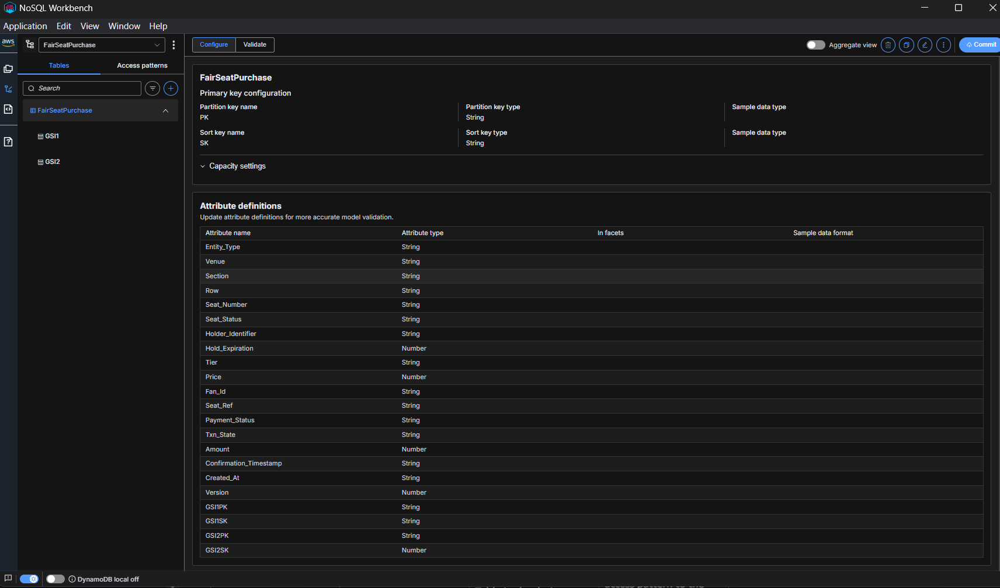
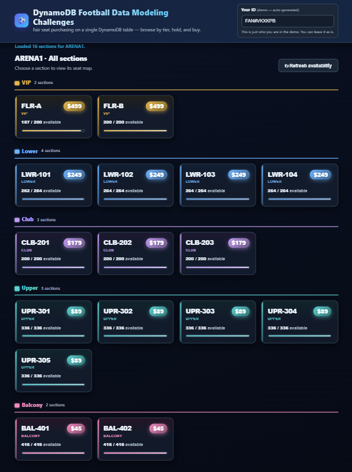
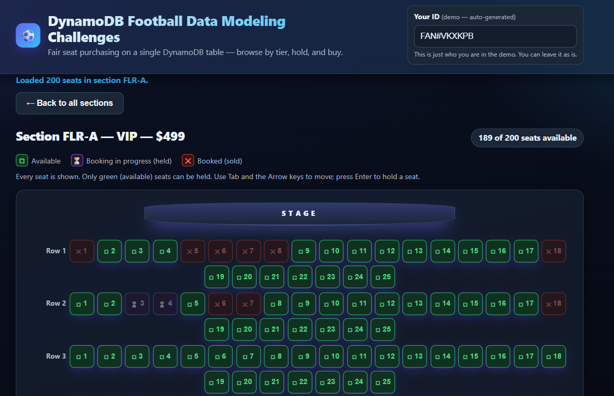

# The Fair Seat Purchase — DynamoDB Ticket Purchasing System
## The problem

When a popular event goes on sale, thousands of fans contend for the same seats in the same
instant. The system must guarantee **sold-exactly-once** under that contention, expire abandoned
holds, and instantly return released seats to inventory — all while feeling fast. This is a
distributed inventory-control / locking problem, solved here with DynamoDB **conditional writes**
and **transactions** (no external lock service).

Lifecycle: **browse → select → hold (atomic) → pay → confirm _or_ release on timeout**.


---

A DynamoDB-powered ticket-purchasing system for a 100,000-seat venue that stays **correct under
extreme concurrency**: every seat is **sold exactly once** — never oversold, never lost — while
the experience stays fast for every fan. Built for the AWS Builder Center **"Fair Seat Purchase"**
challenge, this repo contains the data model, design, and a **fully deployed, live** reference
application on AWS.

## 🌐 Live demo

**https://d1ph0ldhhnu3jn.cloudfront.net**

Open the link, browse the tiered sections, pick a seat, hold it, and check out. Seats update
live: 🟩 available · 🟪 booking in progress (held) · 🟥 booked (sold).

------

## Submission deliverables

| # | Deliverable | File |
|---|---|---|
| 1 | **NoSQL Workbench data model** (valid, importable) | [`fair-seat-purchase.json`](./fair-seat-purchase.json) |
| 2 | **Design document** (explains *why*, not just *what*) | [`DESIGN.md`](./DESIGN.md) |
| 3 | **Access pattern matrix** (every pattern → table/index + key condition + filter) | [`access-patterns.csv`](./access-patterns.csv)  |


------


## Screenshots

### 1. DynamoDB single-table model (NoSQL Workbench)



The `FairSeatPurchase` single-table design imported into **NoSQL Workbench**. One table holds
both seat and transaction entities, keyed by `PK` / `SK` (String), with **GSI1** (available-seat
map) and **GSI2** (expired-hold sweep) in the left tree. The attribute definitions panel shows
the full item shape: `Seat_Status`, `Holder_Identifier`, `Hold_Expiration`, `Tier`/`Price`,
the transaction fields (`Payment_Status`, `Txn_State`, `Amount`, `Confirmation_Timestamp`), and
the GSI key attributes — proving the model is valid and importable.

### 2. Venue overview — tiered sections with live availability



The landing view groups the venue's 16 sections by **price tier** (VIP $499, Lower $249, Club
$179, Upper $89, Balcony $45). Each card shows the section, tier, a price badge, and **live
availability** as both a count and a meter — powered by per-section `Select=COUNT` queries on
**GSI1**. Availability re-polls automatically, so held/sold seats reduce the count in near real
time.

### 3. Seat map — real-time, colour-coded seat status



Drilling into a section (here **FLR-A — VIP — $499**) renders every seat, colour-coded by live
status: 🟩 **available** (◻, the only seats you can hold), 🟪 **booking in progress / held** (⏳),
and 🟥 **booked / sold** (✕). Status is conveyed by glyph **and** colour (never colour alone),
the grid is fully keyboard-navigable (Tab + Arrow keys, Enter to hold), and the header shows the
live "X of Y seats available" count. Seats flip colour live as other fans hold, buy, or release.

---


## Design at a glance

- **Single-table design.** One table holds `SEAT` and `TXN` items (distinguished by key prefixes +
  `Entity_Type`). Keeps confirmation atomic across the seat and its transaction, and keeps every
  access pattern a `GetItem`/`Query`/`UpdateItem`/`TransactWriteItems` — **never a `Scan`**.
- **Sold-exactly-once via conditional writes.** `available → held` is a single conditional
  `UpdateItem` (`Seat_Status = available OR hold expired`). Concurrent contenders serialize on the
  item; exactly one wins, the rest get `ConditionalCheckFailedException`.
- **`held → sold` via `TransactWriteItems`.** The seat flip and the transaction confirmation commit
  all-or-nothing. `sold` is permanent (no outbound transition).
- **Temporary holds (8 min) with hybrid expiration.** Correctness rests on **condition-at-read-time**
  (an expired hold is treated as available in every guard), with an **optional active sweeper** for
  freshness. DynamoDB **TTL is deliberately *not*** the release mechanism (it deletes items; a seat
  must survive and return to `available`).
- **Scale & cost.** Seats spread across many partitions; GSI2 is **write-sharded** (scatter-gather
  on read); GSI projections are scoped (`INCLUDE` / `KEYS_ONLY`); eventually-consistent reads for
  browsing; on-demand billing for the bursty on-sale.

Full rationale and trade-offs are in [`DESIGN.md`](./DESIGN.md).

### Key schema

| Entity | PK | SK |
|---|---|---|
| Seat | `SEAT#<venue>#<section>` | `ROW#<row>#SEAT#<seat>` |
| Transaction | `TXN#<fanId>` | `TXN#<txnId>` |
| Section catalog | `VENUE#<venue>` | `SECTION#<section>` |
| GSI1 (available-seat map) | `SECTION#<venue>#<section>` | `STATUS#available#ROW#..#SEAT#..` |
| GSI2 (expired-hold sweep, sharded) | `HOLDS#<shard>` | `Hold_Expiration` (epoch) |

---

## Architecture

```
Browser ── HTTPS ──> CloudFront ──(OAC)──> S3 (private)         [ static UI ]
   │
   └──── HTTPS/fetch ──> API Gateway (HTTP API) ──> Lambda ──> DynamoDB   [ API + data ]
                                                     (Express app)   (single table + GSI1/GSI2, TTL)
```

- **UI:** private **S3** bucket served via **CloudFront** with **Origin Access Control** (bucket
  never public).
- **API:** the Express app on **Lambda** behind an **API Gateway HTTP API**, CORS-enabled.
- **Data:** a single **DynamoDB** table with GSI1/GSI2 and TTL.


---

## Run it yourself

### Locally (Node + DynamoDB Local)
See [`docs/RUN_LOCAL.md`](./docs/RUN_LOCAL.md).

```bash
docker run --rm -p 8000:8000 amazon/dynamodb-local     # start DynamoDB Local
export FSP_DDB_ENDPOINT=http://localhost:8000           # PowerShell: $env:FSP_DDB_ENDPOINT="http://localhost:8000"
npm run db:create      # create table + GSI1/GSI2 + TTL
npm run db:seed        # seed the tiered ARENA1 venue (~4,568 seats)
npm start              # UI + API at http://localhost:3000
```

### Deploy to AWS (what powers the live demo)
```bash
cd infra
npx cdk bootstrap                          # one-time per account/region
npx cdk deploy --require-approval never     # outputs SiteUrl + ApiUrl
```
The stack **imports** the existing `FairSeatPurchase` table (created by `npm run db:create`), so
run `db:create` + `db:seed` first. Tear down with `npx cdk destroy` (the imported table is left
intact).

---

## Configuration

| Env var | Default | Purpose |
|---|---|---|
| `FSP_TABLE_NAME` | `FairSeatPurchase` | DynamoDB table name |
| `AWS_REGION` | `us-east-1` | AWS region |
| `FSP_DDB_ENDPOINT` | *(unset)* | Point at DynamoDB Local (e.g. `http://localhost:8000`) |
| `PORT` | `3000` | Local API/UI port |
| `FSP_SWEEP_INTERVAL_MS` | `30000` | Active expired-hold sweeper interval (`0` disables) |
| `FSP_CORS_ORIGIN` | `*` | Allowed CORS origin for the API |

---

## Tech stack

TypeScript · AWS SDK v3 · Express · DynamoDB (single-table, GSIs, TTL, conditional writes &
`TransactWriteItems`) · AWS CDK (S3 + CloudFront + Lambda + API Gateway) · vitest + fast-check.


